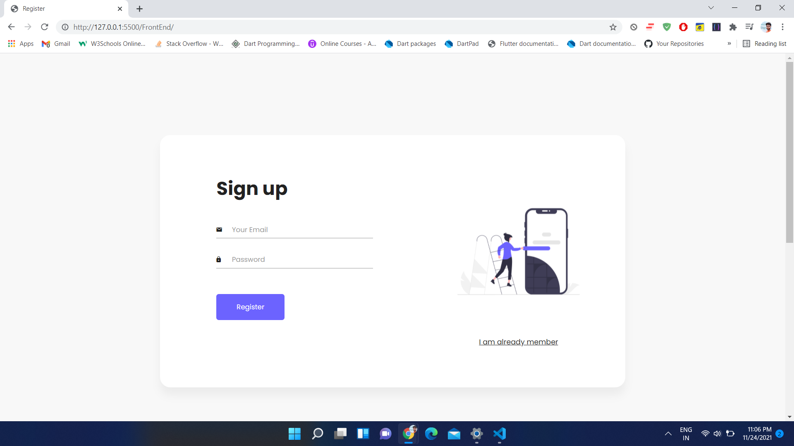
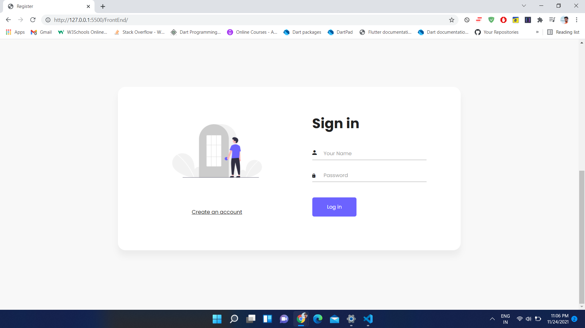
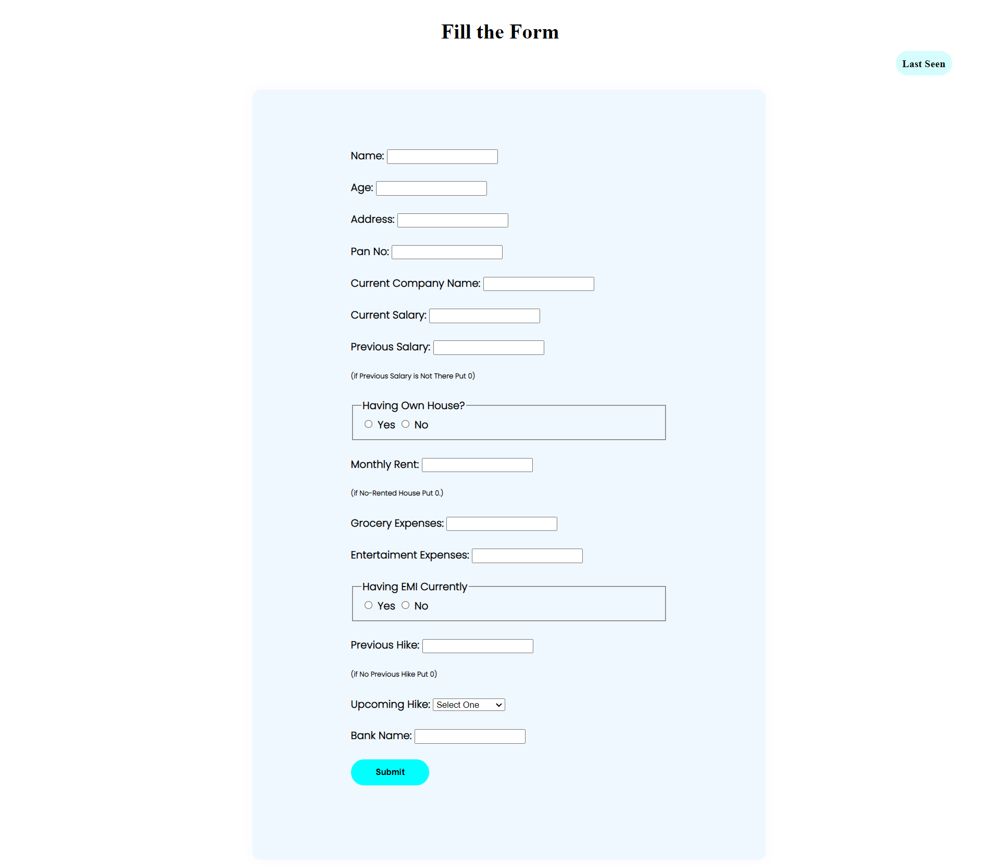
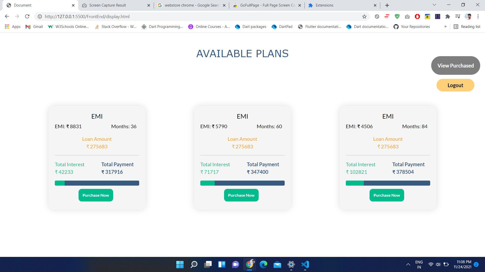
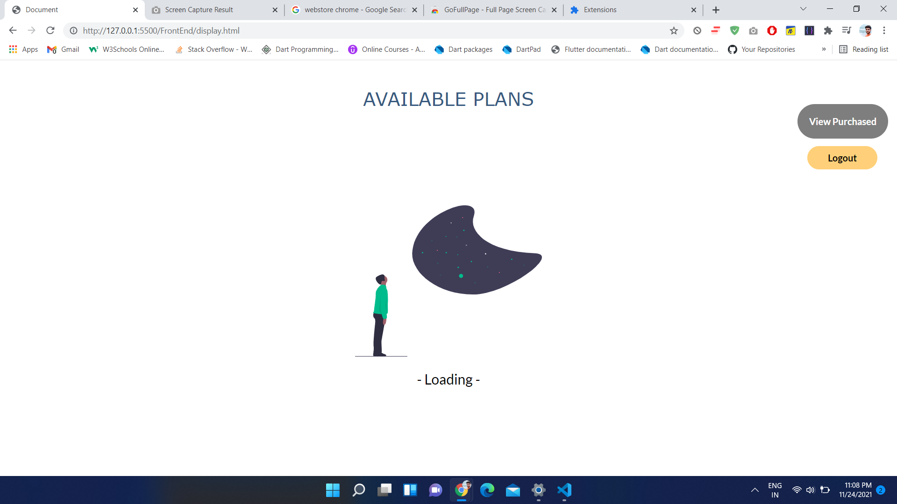
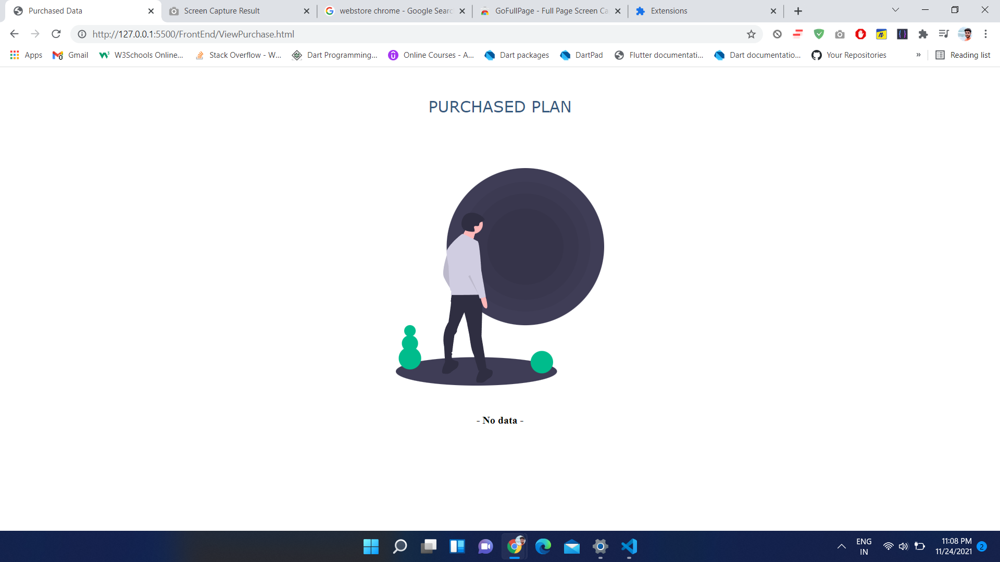
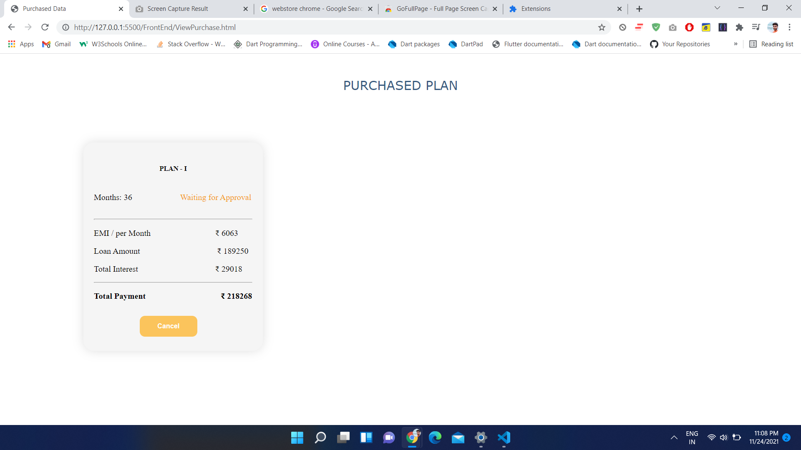

# Micro Credit Loan
This is an example of how you may give instructions on setting up your project locally. To get a local copy up and running follow these simple example steps.

 Front-End
    HTML
    CSS
    JavaScript
    Bootstrap

 Back-End
    JavaScript
    NodeJs
    ExpressJs

 Database
    MongoDB Atlas (NoSql)  

1.Clone the Repository
    ```git clone https://github.com/RakulAgn/Micro_Credit_Application```

2.Install NPM PACKAGES
    ```npm install```

3.Navigate to BackEnd Folder to Start the Server
    ```cd BackEnd```

4.Start the Server 
    ```node index.js```
and Go Live the Index.html Page

## ScreenShot


Description: User SignUp

Description: User SignIn

Description: Form Data to Check Loan

Description: Available Plans to Purchase

Description: Purchased Loan

Description: Purchased Loan

Description: Purchased Loan


   
